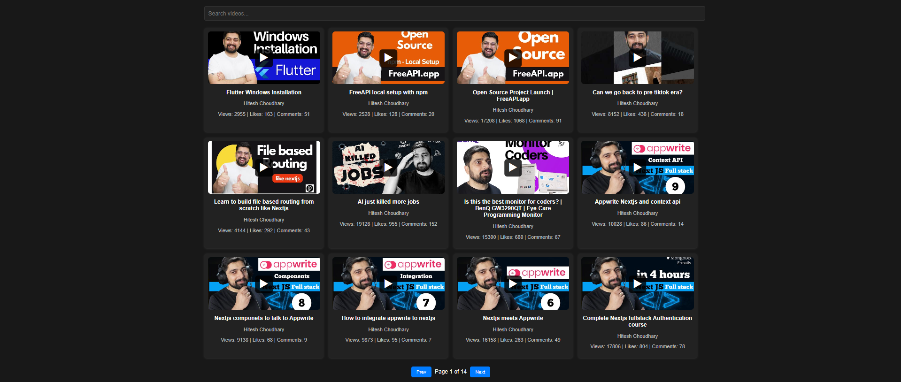
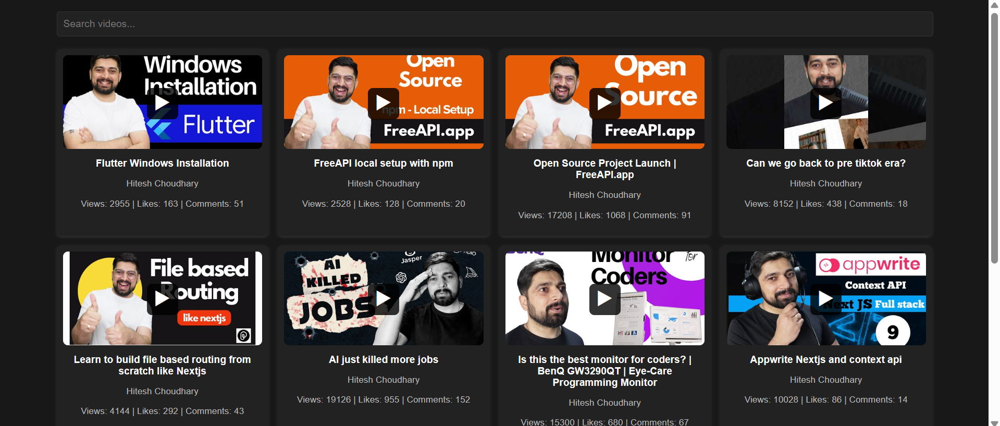
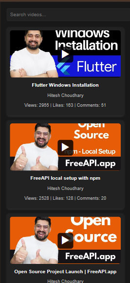

# YouTube Video Listing

## Overview
The YouTube Video Listing project is a simple web application that fetches and displays a list of YouTube videos using the FreeAPI YouTube endpoint. The app provides an intuitive UI with a search bar, pagination, and a dark-themed design.

## Features
- Fetches and displays YouTube videos dynamically.
- Shows video thumbnails, titles, and channel names.
- Click on a video thumbnail to open it on YouTube.
- Search bar to filter videos by title and channel name (frontend-only filtering).
- Pagination to navigate between video listings.
- Play button overlay on thumbnails for better UX.
- Dark mode UI for a modern look.

## Technologies Used
- HTML
- CSS
- JavaScript (Vanilla JS)
- Fetch API for data retrieval

## Installation & Usage
1. Clone the repository:
   ```sh
   git clone https://github.com/dhimannikhil300/YouTube-Video-Listing.git
   ```
2. Navigate to the project folder.
3. Open `index.html` in your browser.
4. Browse videos, search, and navigate between pages.

## Deployment
The application is live at **[Live Demo](https://stirring-lamington-3dd439.netlify.app/)**.

## Screenshots





## Submission
- GitHub Repository: [Repository Link](https://github.com/dhimannikhil300/YouTube-Video-Listing)
- Live Demo: [Deployment Link](https://stirring-lamington-3dd439.netlify.app/)


